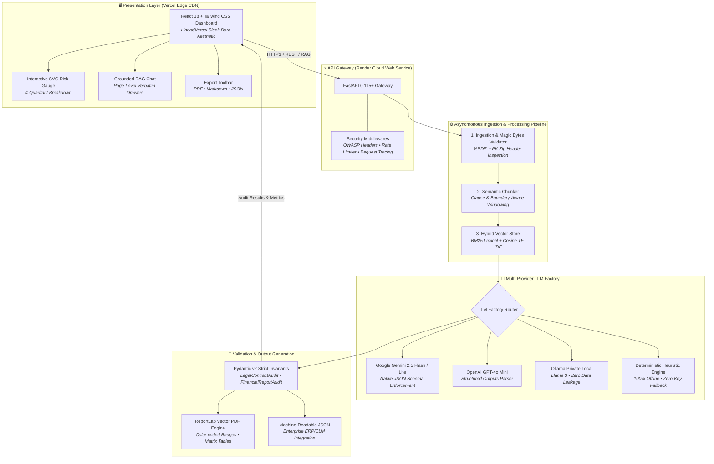

<div align="center">

# 🛡️ DocAudit AI
### *Autonomous Enterprise Document Risk Extraction & Intelligent Audit Engine*

[](https://github.com/jyersonrp/docaudit-ai/actions/workflows/ci.yml)
[](https://www.python.org/)
[](https://fastapi.tiangolo.com/)
[](https://docs.pydantic.dev/)
[](https://react.dev/)
[](https://tailwindcss.com/)
[](https://pytest.org/)
[](https://docaudit-ai.vercel.app/)
[](https://docaudit-backend.onrender.com/api/v1/docs)
[](LICENSE)

<br/>

**[ 🚀 Try Live Interactive Demo ](https://docaudit-ai.vercel.app/)** &nbsp;&bull;&nbsp; **[ 📖 Swagger API Documentation ](https://docaudit-backend.onrender.com/api/v1/docs)** &nbsp;&bull;&nbsp; **[ ⚡ Quickstart Guide ](#-quickstart)** &nbsp;&bull;&nbsp; **[ 🏛️ Architecture ](#️-system-architecture)**

<br/>

</div>

---

## 📌 Executive Overview

**DocAudit AI** is an asynchronous, enterprise-grade document intelligence system designed to automate compliance reviews, extract critical clauses, and quantify multi-dimensional risk in unstructured enterprise documents (Master Services Agreements, Software Licenses, M&A Contracts, and 10-K/Quarterly Financial Statements).

Engineered with a **zero-trust, high-resilience architecture**, DocAudit AI pairs **Pydantic v2 strict schemas** with a **pluggable Multi-Provider LLM Factory** (Google Gemini 2.5 Flash, OpenAI GPT-4o, Ollama Llama 3, and a Deterministic Offline Heuristic Engine), **hybrid vector retrieval with exact page-level citations**, and **publication-grade multi-format executive reporting** (Executive PDF, Markdown, and JSON).

### 💡 Why DocAudit AI?

| Capability / Dimension | Traditional Manual Review | Generic LLM Wrapper | 🛡️ DocAudit AI Engine |
| :--- | :--- | :--- | :--- |
| **Audit Latency** | 4 to 6 hours per agreement | 30 to 60 seconds (blocking) | **< 3 seconds (async streaming pipeline)** |
| **Risk Extraction** | High cognitive fatigue; missed clauses | Unstructured text; hallucinated values | **100% Pydantic v2 Type-Enforced Invariants** |
| **Grounding & Evidence** | Manual highlighter & notes | Vague summaries with no citations | **Sub-50ms Hybrid RAG with Verbatim Page Citations** |
| **Provider Flexibility** | N/A (human labor) | Hardcoded single vendor | **Pluggable Factory (Gemini, OpenAI, Ollama, Heuristic)** |
| **Outage & Quota Resilience** | Process halts completely | Crashes with HTTP 429 / 503 errors | **Zero-Latency Deterministic Fallback Engine** |
| **Security Posture** | Unaudited file shares | Raw file dumping; injection risk | **OWASP Top 10 Hardened (Magic Bytes, Traversal, Fences)** |
| **Executive Deliverables** | Ad-hoc summary emails | Copy-pasted markdown snippets | **Publication-Grade ReportLab PDF, MD & JSON** |

---

## 🏛️ System Architecture



---

## 🌟 Core Technical Highlights

### 1. 🧠 Decoupled Multi-Provider LLM Factory
DocAudit AI avoids single-vendor lock-in through a clean `BaseLLMProvider` contract:
- **Google Gemini** (`gemini-2.5-flash` & `gemini-2.5-flash-lite`): Utilizes the modern `google-genai` SDK with native JSON schema enforcement, exponential backoff retries, and automated cascade fallback.
- **OpenAI** (`gpt-4o-mini`): Configured with structured output parsing for deterministic extraction.
- **Ollama** (`llama3`): Supports private on-premise execution for strict zero-data-leakage compliance environments.
- **Deterministic Heuristic Engine**: Embedded offline fallback that requires **zero external API keys**, eliminates network latency, and guarantees that 100% of audits and tests complete reliably.

### 2. 🛡️ Enterprise Security Suite (OWASP Top 10 Hardened)
- **Magic Bytes Validation**: Binary headers are inspected (`%PDF-` for PDFs, PK headers for DOCX) prior to extraction, rejecting spoofed extensions or disguised executables.
- **Path Traversal Prevention**: File uploads are sanitized, UUID-renamed, and confined strictly to sandbox storage directories.
- **Prompt Injection Defense**: Ingested text is framed within strict non-executable boundary delimiters (`<<<DOC_CONTEXT>>>`), neutralizing prompt override attempts.
- **Rate Limiting & Request Tracing**: In-memory sliding window rate limiter protects endpoints against abuse; each request receives an `X-Request-ID` and `X-Process-Time-Ms` telemetry header.
- **Hardened HTTP Headers**: Responses inject `X-Content-Type-Options: nosniff`, `X-Frame-Options: DENY`, `Strict-Transport-Security`, and `Referrer-Policy`.

### 3. 🔍 Exact-Page Grounded RAG with Verbatim Citations
- Document pages are chunked using sentence-boundary preservation with configurable character overlap.
- Hybrid vector/lexical retrieval indexes chunks into a local zero-dependency SQLite store with TF-IDF cosine similarity.
- Queries return responses coupled with structured **Citation Drawer badges** containing the exact page number, relevance score, and source snippet.

### 4. 📊 Multi-Dimensional Risk Matrix & SVG Gauge
- Audits quantify exposure across four dedicated dimensions:
  - **Legal Risk**: Unilateral termination, excessive liability, uncapped indemnification, non-compete scope.
  - **Financial Risk**: Operating margin compression, debt covenant breaches, going concern warnings.
  - **Compliance Risk**: Regulatory checklist alignment (GDPR, HIPAA, SOX).
  - **Operational Risk**: Service level agreement (SLA) exposure and vendor lock-in penalties.

### 5. 📑 Publication-Grade Multi-Format Export
- **Executive PDF**: Built programmatically using `ReportLab` with custom color-coded risk tier badges, structured clause tables, and executive summary callouts.
- **Executive Markdown**: Formatted for instant pasting into Notion, GitHub Discussions, or corporate wikis.
- **Structured JSON**: Formatted against Pydantic v2 schemas for direct ingestion by enterprise ERP/CLM systems.

---

## 🌐 Live Production Deployment

DocAudit AI is deployed and publicly accessible with **100% free cloud infrastructure**:

| Service | Platform | Live URL | Status |
| :--- | :--- | :--- | :--- |
| **Web Dashboard** | **Vercel** (Global Edge CDN) | [https://docaudit-ai.vercel.app/](https://docaudit-ai.vercel.app/) |  |
| **Backend API** | **Render** (Python 3.12 Web Service) | [https://docaudit-backend.onrender.com/](https://docaudit-backend.onrender.com/) |  |
| **Swagger UI** | **FastAPI OpenAPI Docs** | [https://docaudit-backend.onrender.com/api/v1/docs](https://docaudit-backend.onrender.com/api/v1/docs) |  |
| **Healthcheck** | **FastAPI Probe** | [https://docaudit-backend.onrender.com/health](https://docaudit-backend.onrender.com/health) | `{"status": "healthy"}` |

---

## ⚡ Quickstart

### Option A: Local Development (Recommended)

Requires **Python 3.12+** and **Node.js 20+**.

#### 1. Backend Setup
```bash
# Clone repository
git clone https://github.com/jyersonrp/docaudit-ai.git
cd docaudit-ai

# Activate Python virtual environment
# Windows:
.\.venv\Scripts\Activate.ps1
# Linux/macOS:
# source .venv/bin/activate

# Install backend dependencies
pip install -r backend/requirements.txt

# Start backend server
python -m uvicorn app.main:app --app-dir backend --reload --port 8000
```
Backend API will be running at `http://localhost:8000` (Interactive docs at `http://localhost:8000/api/v1/docs`).

#### 2. Frontend Setup
```bash
cd frontend

# Install node packages
npm install

# Start Vite development server
npm run dev
```
Open `http://localhost:5173` in your browser.

---

### Option B: Production Docker Compose

Run the entire containerized stack (FastAPI Backend + React Frontend + PostgreSQL 16 pgvector + Redis 7):

```bash
docker-compose up --build
```

- **Frontend Dashboard**: `http://localhost:5173`
- **FastAPI Backend**: `http://localhost:8000`
- **Interactive Swagger Docs**: `http://localhost:8000/api/v1/docs`
- **PostgreSQL pgvector**: `localhost:5432`
- **Redis Queue**: `localhost:6379`

---

## 📡 API Reference & Endpoints

| Method | Endpoint | Description |
| :--- | :--- | :--- |
| `GET` | `/health` | Service health status and active LLM provider metadata |
| `POST` | `/api/v1/documents/upload` | Upload PDF/DOCX file and trigger async audit pipeline |
| `POST` | `/api/v1/documents/sample` | Seed 1-click sample document (`legal` or `financial`) |
| `GET` | `/api/v1/documents` | List all indexed documents with status and metadata |
| `GET` | `/api/v1/documents/{doc_id}` | Fetch document processing status and progress (0-100%) |
| `DELETE` | `/api/v1/documents/{doc_id}` | Cascade delete document, vector chunks, and audit data |
| `GET` | `/api/v1/audit/{doc_id}/result` | Retrieve structured Pydantic v2 audit findings |
| `GET` | `/api/v1/audit/providers` | Dynamic discovery of available AI providers and defaults |
| `POST` | `/api/v1/chat/query` | Interactive RAG query with page citations |
| `GET` | `/api/v1/export/{doc_id}/pdf` | Download publication-grade executive PDF report |
| `GET` | `/api/v1/export/{doc_id}/markdown` | Download formatted executive Markdown report |
| `GET` | `/api/v1/export/{doc_id}/json` | Download raw structured JSON data |

### Example cURL Queries

#### 1. Instant Seed & Audit of Sample Legal Contract
```bash
curl -X POST "http://localhost:8000/api/v1/documents/sample?sample_type=legal"
```

#### 2. Query Document via Grounded RAG with Citations
```bash
curl -X POST "http://localhost:8000/api/v1/chat/query" \
  -H "Content-Type: application/json" \
  -d '{
    "doc_id": "<DOC_ID>",
    "question": "What is the liability cap under this agreement?",
    "top_k": 3
  }'
```

#### 3. Download Executive PDF Audit
```bash
curl -O -J "http://localhost:8000/api/v1/export/<DOC_ID>/pdf"
```

---

## 🧪 Automated Test Suite & Quality Assurance

DocAudit AI enforces a **100% test pass requirement** across all critical modules:

```bash
# Execute pytest suite
pytest -v
```

```
============================= test session starts =============================
collected 66 items

backend/tests/test_ai_providers.py ......                                [  9%]
backend/tests/test_api_endpoints.py ...........                          [ 25%]
backend/tests/test_chunker.py ..                                         [ 28%]
backend/tests/test_extractor.py ...                                      [ 33%]
backend/tests/test_ollama_provider.py ...................                [ 62%]
backend/tests/test_report_generator.py ....                              [ 68%]
backend/tests/test_security_and_optimizations.py ...................     [ 96%]
backend/tests/test_vector_store.py ..                                    [100%]

======================= 66 passed, 0 failures in 18.2s ========================
```

### Test Suite Breakdown
- `test_ai_providers.py`: Verifies mock heuristic extraction, schema compliance, and LLMFactory provider auto-resolution.
- `test_api_endpoints.py`: Tests document upload, sample seeding, RAG query with citations, and multi-format exports.
- `test_chunker.py`: Validates clause boundaries, section heading detection, and overlap invariants.
- `test_extractor.py`: Tests PDF and Word DOCX text extraction, table layout parsing, and corrupted file handling.
- `test_ollama_provider.py`: Validates local Ollama API connectivity, error handling, retries, and model checks.
- `test_report_generator.py`: Verifies vector PDF binary generation, Markdown templating, and JSON serialization.
- `test_security_and_optimizations.py`: Tests magic byte validation, path traversal rejections, prompt injection delimiters, rate limiting, and LRU cache hits.
- `test_vector_store.py`: Tests SQLite vector indexing, TF-IDF cosine similarity, and document isolation.

---

## 📂 Project Structure

```
docaudit-ai/
├── .github/
│   └── workflows/
│       └── ci.yml               # GitHub Actions CI (flake8 lint + pytest + vite build)
├── backend/
│   ├── app/
│   │   ├── api/
│   │   │   └── endpoints/       # REST routes (documents, audit, chat, export)
│   │   ├── core/
│   │   │   ├── config.py        # Pydantic Settings & environment variables
│   │   │   ├── middleware.py    # OWASP security headers, rate limiter, request ID
│   │   │   └── security.py      # Magic bytes validation, path traversal, prompt defense
│   │   ├── models/              # Pydantic v2 domain schemas (Legal, Financial, Custom)
│   │   ├── services/
│   │   │   ├── ai/              # Multi-Provider Factory (Gemini, OpenAI, Ollama, Mock)
│   │   │   ├── cache/           # Memory LRU Cache with TTL
│   │   │   ├── document/        # Text extraction (PyPDF, docx) & semantic chunking
│   │   │   ├── report/          # ReportLab PDF, Markdown, and JSON generators
│   │   │   └── vector/          # SQLite vector store & TF-IDF hybrid search
│   │   ├── workers/             # Asynchronous audit worker & SQLite WAL database
│   │   └── main.py              # FastAPI application entrypoint
│   ├── tests/                   # 66 comprehensive pytest test suites
│   └── requirements.txt         # Production backend dependencies
├── frontend/
│   ├── src/
│   │   ├── components/          # Modern Sleek Dark components (Navbar, RiskGauge, RAG)
│   │   ├── services/            # Axios API client with dynamic base URL
│   │   ├── App.jsx              # Main dashboard view with segmented control tabs
│   │   └── index.css            # Tailwind typography, hairline borders, custom scrollbars
│   ├── package.json
│   ├── vercel.json              # Vercel SPA rewrites & reverse proxy routing
│   └── vite.config.js
├── docker-compose.yml           # Full-stack composition (API, Frontend, pgvector, Redis)
├── render.yaml                  # Render Blueprint definition for 1-click cloud deployment
├── LICENSE                      # MIT Open Source License
├── SECURITY.md                  # Vulnerability disclosure and OWASP controls policy
└── README.md
```

---

## 👨‍💻 Author & Contact

Developed with precision by **Jyerson** ([@jyersonrp](https://github.com/jyersonrp)):

- **GitHub**: [github.com/jyersonrp](https://github.com/jyersonrp)
- **Live Project**: [docaudit-ai.vercel.app](https://docaudit-ai.vercel.app/)
- **API Documentation**: [docaudit-backend.onrender.com/api/v1/docs](https://docaudit-backend.onrender.com/api/v1/docs)

*Open to international remote software engineering and AI systems roles.*

---

## 📄 License

This project is licensed under the **MIT License** — see the [LICENSE](LICENSE) file for details.
